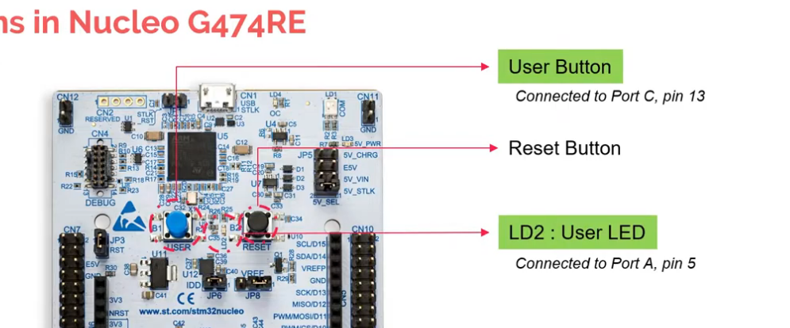
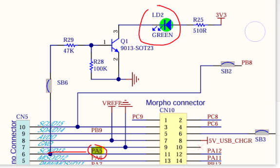
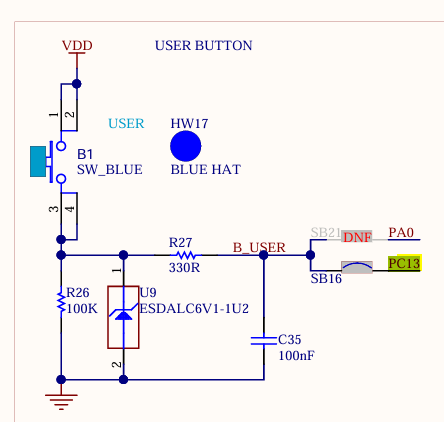
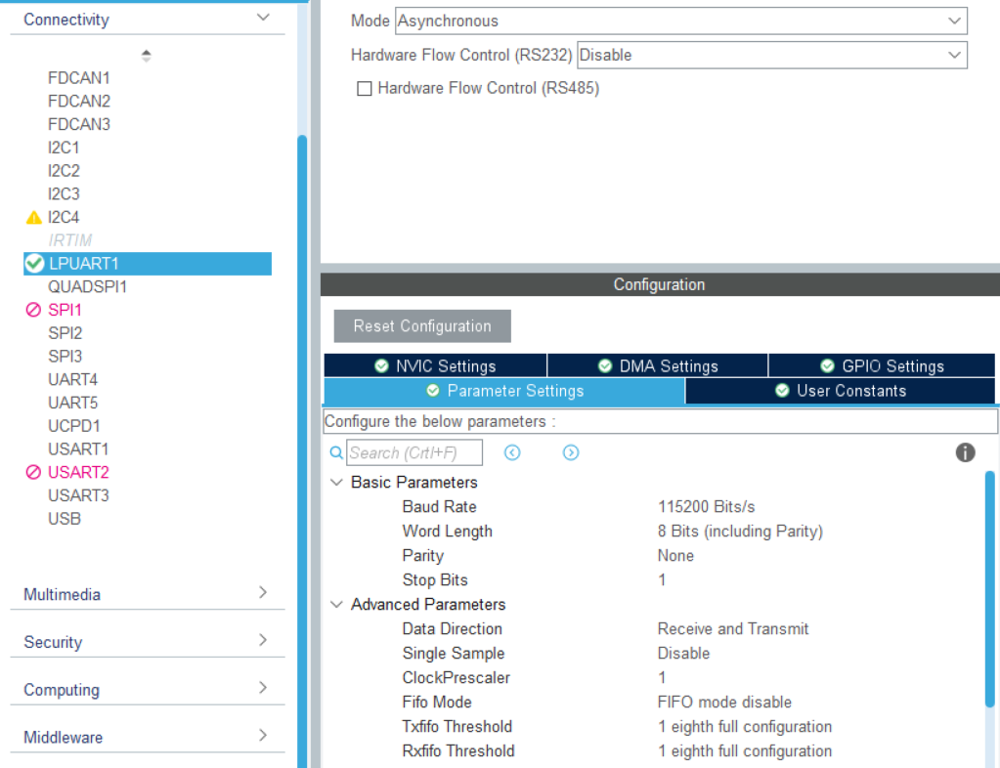
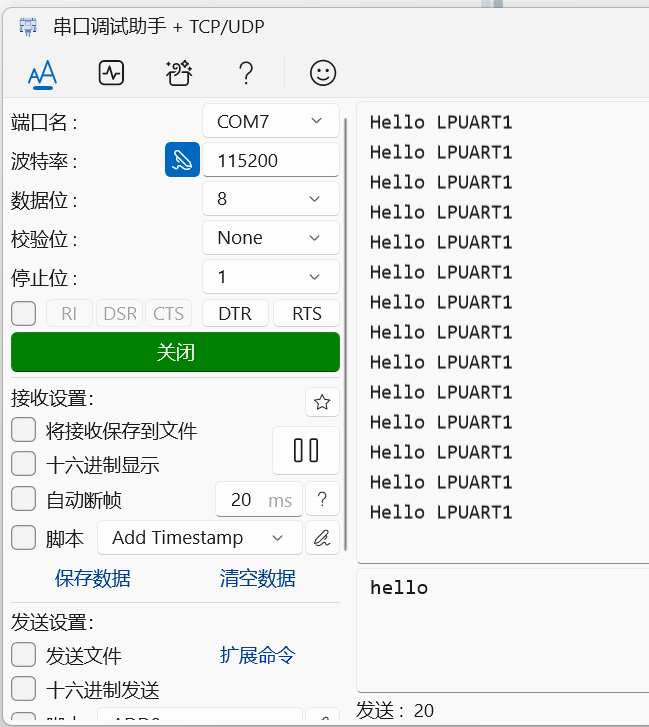

这里是一些小项目，帮助我理解这个板子和软件怎么使用

# Blink LED

用计算机课设提供的板子，先上手一个简单的小项目（类似C语言项目的HELLO WORLD！）

视频链接（油管的，可以开自带的中文翻译字幕食用。或者项目3中的视频链接也有-需注册订阅）：

[How to blink an LED using STM32 Nucleo Board | ARM Microcontroller | STM32G474 | Episode 2](https://www.youtube.com/watch?v=Ei0U9lig9_E)

选中的是开发板——NUCLEO-G474RE，而不是微处理器（芯片）

过程可能有所不同，因为软件版本等原因（最号要有VPN，否则软件上使用可能会碰到问题——下载一些必需的支持包）

总体而言十分简单就实现了（按照视频步骤来即可

代码片段：

```
  while (1)
  {
    /* USER CODE END WHILE */

		HAL_GPIO_TogglePin(GPIOA,GPIO_PIN_5);//翻转这个GPIO（位于A组5号）引脚的电平。
		HAL_Delay(1000);
    /* USER CODE BEGIN 3 */
  }
  /* USER CODE END 3 */
}
```

# **Push Button Example** 

视频步骤演示也是上面的那个视频，是第三集，视频简介里跳转即可。其他集数我这个课设就完全用不到（所以略过）



关于为什么LED2接的是PortA，pin5（第A组GPIO的第5个gpio引脚）。要看引脚图



这个是那个蓝色的按钮对应的引脚



```
if(HAL_GPIO_ReadPin(GPIOC,GPIO_PIN_13) == GPIO_PIN_RESET){ //如果引脚输入为0——没按下的意思
				HAL_GPIO_WritePin(GPIOA,GPIO_PIN_5,GPIO_PIN_RESET); // LED对应引脚复位，输出低电平就是灭了。
			}
			else{
				HAL_GPIO_WritePin(GPIOA,GPIO_PIN_5,GPIO_PIN_SET);
			}

```

# 串口打印调试

参考下面视频教程， 下载对应软件和驱动。

[嵌入式技术专业人才认证平台](https://www.eetalent.cn/coursedetail?id=15c897af777d43fe85892f1214291920)

我们使用STM32CubeMX的开发板模板后，它就自动帮我们配置好了串口的通道和波特率。

于是加上代码便可实现接受到信息的效果，方便我们进行调试。比如温度检测输出温度，看是否合理

```
HAL_UART_Transmit(&hlpuart1, (uint8_t*)"Hello LPUART1\r\n", 15, 100);
HAL_Delay(1000);
```




