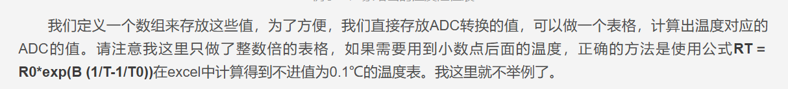

# 说明

HUST AIA 23级计算机控制技术课程设计——温度传感与LCD显示

课设题目要求

1.通过热敏电阻实现温度检测（可自行购置）； 

2.温度检测数量滤波要求及其算法实现；

3.滤波结果通过LCD回显

硬件设备（板子是NUCLEO-G474RE）：


接线原理图，见报告或者其他资源部分。


# 温度检测原理

这部分具体实现组员负责。初步的大体框架1.得到采样的ADC值。2.通过查表法，将ADC值转化为温度。3.温度区间内，要通过计算法实现（参考下面图片）。表来源：问买的热敏电阻的商家提供。



# 温度滤波原理

传感器读取的数据很可能含有噪声抖动，比如

```markdown
24.8 25.2 25.1 24.9 25.3...
```

所以，我们需要一种滤波算法，让数据更加平滑的变化。下面来介绍本次课设所采用的算法以及其与其他常见滤波算法效果比对。

## 一阶卡尔曼滤波

### 原理

参考链接[一阶卡尔曼滤波入门教程：从原理到单片机 C 代码实现](https://jishuzhan.net/article/2052189349916246018)

核心思想：根据传感器测量值和预测值做一个聪明的加权平均。实际表现为传感器噪声大，少相信传感器；系统变化快，多相信传感器。

| 变量 | 含义           | 说明                                                         |
| ---- | -------------- | ------------------------------------------------------------ |
| out  | 当前估计值     | 滤波后的输出结果                                             |
| in   | 当前测量值     | 输入值                                                       |
| Q    | 过程噪声协方差 | 表示系统本身变化的不确定度。本课设表现为NTC电阻变化的快慢。  |
| R    | 测量噪声协方差 | 传感器测量噪声。本课设表现为ADC量化误差、电磁干扰等噪声影响。 |
| P    | 估计误差协方差 | 表示当前估计值的不确定程度                                   |
| k    | 卡尔曼增益     | 相信测量值还是预测值                                         |

初步算法思想以及代码实现

```c
typedef struct
{
  float Last_P; 
  float Now_P; //当前估计误差
  float out;
  float K;
  float Q;
  float R;
} KaF;

#define KAF_INIT_P  1.f //初始的估计误差
#define KAF_INIT_OUT 25.f // 初始的测量值
#define KAF_INIT_Q  0.2f// 过程噪声，推荐取0.001~0.01
#define KAF_INIT_R  0.6f// 测量噪声，推荐取 0.1~1

KaF temp_filter_setup;

float Kalman_out(KaF *Kal, float in)
{
  // k时刻估计误差协方差 = k-1时刻的估计误差协方差 + 过程噪声协方差
  Kal->Now_P = Kal->Last_P + Kal->Q;//估计误差随时间流逝而增加
  // 卡尔曼增益 = 估计误差/(估计误差+测量噪声) k时刻
  Kal->K = Kal->Now_P / (Kal->Now_P + Kal->R);
  // 当前估计值，测量值与估计值的加权
  // k时刻状态变量最优值 = 预测值 + 卡尔曼增益*(测量值-状态变量)
  Kal->out = Kal->out + Kal->K * (in - Kal->out);
  // 更新下一次的估计误差，调整对测量值的相信程度
  Kal->Last_P = (1.f - Kal->K) * Kal->Now_P; //修正估计值后，根据卡尔曼增益，降低认为的误差。
  return Kal->out;
}
void Kalman_init(KaF *kf, float init_p, float init_out, float init_q, float init_r){
  kf->Last_P = init_p ;
  kf->Now_P= 0.0f;
  kf->out=init_out;
  kf->K= 0.0f;
  kf->Q=init_q;
  kf->R=init_r;
}
void temp_filter_init(void){
  Kalman_init(&temp_filter_setup,KAF_INIT_P,KAF_INIT_OUT,KAF_INIT_Q,KAF_INIT_R);
}
```

### 参数整定

| 参数变化 | 效果                       |
| -------- | -------------------------- |
| q 增大   | 响应更快，但数据更容易抖   |
| q 减小   | 数据更平滑，但响应变慢     |
| r 增大   | 更不相信测量值，滤波更平滑 |
| r 减小   | 更相信测量值，响应更快     |

想要响应快：增大 q 或减小 r 

想要更平滑：减小 q 或增大 r

## 效果分析比较

设定相同的温度输入值。用串口调试助手获取滤波前、滤波后值，从而用excel绘图。反应滤波效果。

### 原卡尔曼滤波


### 中值滤波

中值滤波是将信号的连续m次采样值按大小进行排序，取其中间值作为 本次的有效采样值。


### 滑动平均滤波

滑动平均滤波是在每个采样周期只采样一次，将这一次采样值和过去的若 干次采样值一起算术平均或加权平均


### 改进后的卡尔曼滤波


## 算法改进思路

### 添加异常值处理

比如有时电路有问题，突然松动，会导致输出骤变。此时不应该直接交给卡尔曼滤波，先做异常判断。比如下面的一个测试结果图


所以改进函数如下：

```c
float Kalman_out(KaF *Kal, float in, float max_inc)
{
  float diff;
  diff = in -Kal->out;
  if (fabsf(diff) > max_inc)
  {
    in=Kal->out;
  }

  Kal->Now_P = Kal->Last_P + Kal->Q; // 估计误差随时间流逝而增加
  Kal->K = Kal->Now_P / (Kal->Now_P + Kal->R);
  Kal->out = Kal->out + Kal->K * (in - Kal->out);
  Kal->Last_P = (1.f - Kal->K) * Kal->Now_P; 。
  return Kal->out;
}
```

这样之后，当我们手动断开电路，模拟电路抽风，发现输出能够保持，而不是跳变。


### 基于温度变化自适应修改Q、R值

在前面，我们所使用的过程噪声和测量噪声都是固定值。那是根据室温变化而取定的，但是实际上，如果我们测温温度变化巨大，那么卡尔曼滤波的动态响应就比较慢，效果不是很好，需要等待较长时间收敛。于是，采用基于温度变化幅度的自适应方法，如果温度变化明显，则自动修正Q、R值。

```c
float Kalman_out(KaF *Kal, float in, float max_inc)
{
  float diff;
  diff = in - Kal->out;
  float abs_diff = fabsf(diff);
  if (abs_diff > max_inc) //跳变过大，说明可能电路扰动等
  {
    in = Kal->out;
    diff = in - Kal->out;
    abs_diff = fabsf(diff);
  }

  //Q、R随温度差值自动调整，为函数映射关系。
  float alpha =0.0f;
  if(abs_diff >KAF_ADAPT_START) //
  {
   alpha = (abs_diff-KAF_ADAPT_START) / (KAF_DIFF_FULL-KAF_ADAPT_START);
   if(alpha>1.0f){
     alpha=1.0f;
    }
    alpha *=alpha;
	}
     Kal->Q = KAF_Q_MIN+ (KAF_Q_MAX-KAF_Q_MIN)*alpha;
  Kal->R = KAF_R_MAX- (KAF_R_MAX-KAF_R_MIN)*alpha;
    
  Kal->Now_P = Kal->Last_P + Kal->Q; // 估计误差随时间流逝而增加
  Kal->K = Kal->Now_P / (Kal->Now_P + Kal->R);
  Kal->out = Kal->out + Kal->K * (in - Kal->out);
  Kal->Last_P = (1.f - Kal->K) * Kal->Now_P; 
  return Kal->out;
}
```


### 初始化输出采用第一次采样结果

out的初值会影响刚启动时的收敛速度，并且，由于前面的异常值处理。如果实际温度过大，初始diff便会大于最大增量，导致代码执行in = Kal->out;从而产生bug。故代码改进如下：

```c
void temp_filter_init(float init_value)
{
  Kalman_init(&temp_filter_setup, KAF_INIT_P, init_value, KAF_INIT_Q, KAF_INIT_R);
}
float Get_Init_Temperature(void)
{
  float sum = 0.0f;
  uint8_t count = 0;

  for (int i = 0; i < 5; i++)
  {
    uint32_t adc = Read_ADC_Value();
    float temp = ADC_To_Temperature(adc);

    if (temp > -100.0f && temp < 150.0f)
    {
      sum += temp;
      count++;
    }

    HAL_Delay(10);
  }

  if (count == 0)
  {
    return KAF_INIT_OUT;
  }

  return sum / count;
}

//主函数中执行一次。
  init_temp = Get_Init_Temperature();
  temp_filter_init(init_temp);
```

## 最终代码

```c
typedef struct
{
  /* 上一次滤波后的估计误差协方差，用于下一次预测 */
  float Last_P;
  /* 当前预测得到的估计误差协方差 */
  float Now_P;
  /* 卡尔曼滤波输出值，也就是滤波后的温度值 */
  float out;
  /* 卡尔曼增益，决定本次测量值参与修正的比例 */
  float K;
  /* 过程噪声，数值越大，滤波结果越容易跟随温度变化 */
  float Q;
  /* 测量噪声，数值越大，滤波结果越不容易被瞬时测量值影响 */
  float R;
} KaF;
/* 卡尔曼滤波初始参数 */
#define KAF_INIT_P 0.1    
#define KAF_INIT_OUT 25.f 
#define KAF_MAX_INC 10.f

/* 自适应卡尔曼滤波的 Q、R 参数范围 */
#define KAF_Q_MIN 0.005f
#define KAF_Q_MAX 0.05f
#define KAF_R_MIN 0.2f
#define KAF_R_MAX 1.5f
#define KAF_INIT_Q KAF_Q_MIN  
#define KAF_INIT_R KAF_R_MAX   
#define KAF_DIFF_FULL 2.5f  // 自适应范围
#define KAF_ADAPT_START 0.2f // 自适应起始点

/* 温度越限报警阈值和回差参数 */
#define TEMP_UPPER 30.0f   // 上限
#define TEMP_LOWER 25.0f   // 下限
#define HYSTERESIS 0.5f    // 回差

KaF temp_filter_setup;   /* 温度卡尔曼滤波器对象 */
float init_temp;          /* 上电时采集到的初始温度 */
uint8_t led_state = 0;  /* LED报警状态标志：0表示当前未报警，1表示当前正在报警 */

float Kalman_out(KaF *Kal, float in, float max_inc);
void Kalman_init(KaF *kf, float init_p, float init_out, float init_q, float init_r);
void temp_filter_init(float init_value);
float Get_Init_Temperature(void);


/**
  * @brief  对温度测量值进行自适应卡尔曼滤波
  * @param  Kal 卡尔曼滤波结构体指针
  * @param  in 本次输入的原始温度测量值
  * @param  max_inc 允许的最大温度跳变量，超过该值认为是异常扰动
  * @retval 滤波后的温度值
  */
float Kalman_out(KaF *Kal, float in, float max_inc)
{
  float diff;
  /* 计算当前测量值和上一次滤波输出值之间的差值 */
  diff = in - Kal->out;
  float abs_diff = fabsf(diff);
  if (abs_diff > max_inc) // 跳变过大，说明可能电路扰动等
  {
    /* 差值超过最大允许范围时，丢弃本次异常测量值 */
    in = Kal->out;
    diff = in - Kal->out;
    abs_diff = fabsf(diff);
  }
  // Q、R随温度差值自动调整，为函数映射关系??
  /* alpha 用来表示温度变化的强弱，后面用于动态调整 Q 和 R */
  float alpha = 0.0f;
  if (abs_diff > KAF_ADAPT_START)
  {
    /* 将温度差映射到 0~1 范围 */
    alpha = (abs_diff - KAF_ADAPT_START) / (KAF_DIFF_FULL - KAF_ADAPT_START);
    if (alpha > 1.0f)
    {
      alpha = 1.0f;
    }
    //平方处理
    alpha *= alpha;
  }
  /* 温度变化越明显，Q 越大、R 越小，使滤波输出更快跟随真实温度 */
  Kal->Q = KAF_Q_MIN + (KAF_Q_MAX - KAF_Q_MIN) * alpha;
  Kal->R = KAF_R_MAX - (KAF_R_MAX - KAF_R_MIN) * alpha;

  // k时刻估计误差 = k-1时刻的估计误差 + 过程噪声
  Kal->Now_P = Kal->Last_P + Kal->Q; 
  // 卡尔曼增益= 估计误差/(估计误差+测量噪声) k时刻
  Kal->K = Kal->Now_P / (Kal->Now_P + Kal->R);
  // 当前估计值，测量值与估计值的加权
  Kal->out = Kal->out + Kal->K * (in - Kal->out);
  // 更新下一次的估计误差，调整对测量值的相信程度
  Kal->Last_P = (1.f - Kal->K) * Kal->Now_P;
  return Kal->out;
}
/**
  * @brief  初始化卡尔曼滤波器参数
  * @param  kf 卡尔曼滤波结构体指针
  * @param  init_p 初始估计误差协方差
  * @param  init_out 初始输出值
  * @param  init_q 初始过程噪声
  * @param  init_r 初始测量噪声
  * @retval None
  */
void Kalman_init(KaF *kf, float init_p, float init_out, float init_q, float init_r)
{
  kf->Last_P = init_p;   /* 设置初始估计误差 */
  kf->Now_P = 0.0f;      /* 当前估计误差初始为0 */
  kf->out = init_out;    /* 初始滤波输出，一般使用上电平均温度 */
  kf->K = 0.0f;          /* 卡尔曼增益初始为0 */
  kf->Q = init_q;        /* 过程噪声初始值 */
  kf->R = init_r;        /* 测量噪声初始值 */
}
/**
  * @brief  初始化温度滤波器
  * @param  init_value 初始温度值
  * @retval None
  */
void temp_filter_init(float init_value)
{
  /* 使用上电时的初始温度作为滤波器初始输出值 */
  Kalman_init(&temp_filter_setup, KAF_INIT_P, init_value, KAF_INIT_Q, KAF_INIT_R);
}
/**
  * @brief  上电后多次采样，计算初始温度平均值
  * @note   这样可以避免单次采样抖动导致滤波器初值偏差过大。
  * @retval 初始温度平均值；采样全部异常时返回默认初值
  */
float Get_Init_Temperature(void)
{
  float sum = 0.0f;
  uint8_t count = 0;
  /* 连续采样5次，取有效温度的平均值 */
  for (int i = 0; i < 5; i++)
  {
    /* 读取ADC并换算为摄氏温度 */
    uint32_t adc = Read_ADC_Value();
    float temp = ADC_To_Temperature(adc);
    /* 过滤明显不合理的温度值，只累加有效数据 */
    if (temp > -100.0f && temp < 150.0f)
    {
      sum += temp;
      count++;
    }
    HAL_Delay(10);
  }

  /* 如果5次采样都无效，则使用默认初始温度 */
  if (count == 0)
  {
    return KAF_INIT_OUT;
  }

  return sum / count;
}


主函数调用部分
int main(void){
-----------------------------------------------
//这里是自己定义的初始化代码
/* 对 ADC 进行校准，提高温度采样准确性 */
HAL_ADCEx_Calibration_Start(&hadc1, ADC_SINGLE_ENDED);

/* 上电后先获取一个较稳定的初始温度 */
init_temp = Get_Init_Temperature();

/* 用初始温度初始化卡尔曼滤波器 */
temp_filter_init(init_temp);

while (1)
  {
-----------------------------------------------    
/* 3. 对温度进行卡尔曼滤波，减小抖动 */
float temperature = Kalman_out(&temp_filter_setup, temp_measure, KAF_MAX_INC);
-----------------------------------------------

HAL_Delay(500);

}
}
```


# 越限报警

这里用LED灯的亮表示。原理图类似下面。只不过没搞上面的e


代码如下

```
if(!led_state) {
        if(temperature > TEMP_UPPER || temperature < TEMP_LOWER) {
            HAL_GPIO_WritePin(GPIOA, GPIO_PIN_5, GPIO_PIN_SET);
            led_state = 1;
        }
    } else {
        if(temperature < TEMP_UPPER - HYSTERESIS && temperature > TEMP_LOWER + HYSTERESIS) {
            HAL_GPIO_WritePin(GPIOA, GPIO_PIN_5, GPIO_PIN_RESET);
            led_state = 0;
        }
    }
```


# TCP通信

 用到的串口调试软件、和另一个sscom5


运行步骤

## 内网穿透+本地服务器

内网穿透参考TCP通信里面的pdf介绍。

本地服务器python代码也在那（可以自定义修改一些东西）。要注意的是接收到的字符串格式

内网穿透如下，TCP端口3000


本地服务器如下：WEB端口5000，监听TCP端口3000


## 硬件连接

通信板开关搞到**USB供电**（更稳定），最好用可传输数据的线连接（手机充电线即可）；stm32板子要烧录好代码，并且供电。最好结合串口通信调试，多试几次（有时会抽风，重给通信板供电啥的）

插入手机的SIM卡到那个板子上！

CUBEMX中，要配置PA9\PA10引脚功能为串口通信啥的，还要使能。


## 通信代码

可以先用AT调试，端口选0（有6个0-6，其功能不同，0是用于AT指令的）.

关于怎么连接到网络，要根据图中的指令来。其中请求IP是必须的，然后再连接公网IP。


```
/TCP通信用
/* 给 L610 模块预留上电入网和输出启动信息的时间 */
HAL_Delay(8000);   // ? L610 ??,??????

/* 打印 L610 上电后的启动信息，便于判断模块是否正常工作 */
PC_SendString("\r\nClean boot messages:\r\n");
L610_ReceiveAndPrint(3000);

PC_SendString("\r\nL610 TCP TEST START\r\n");

/* 测试 AT 通信是否正常 */
L610_TestCmd("AT\r\n", 2000);
/* 打开回显，方便在串口调试助手中看到发送的命令 */
L610_TestCmd("ATE1\r\n", 2000);
/* 查询 SIM 卡状态，正常应返回 READY */
L610_TestCmd("AT+CPIN?\r\n", 2000);
/* 查询信号质量，判断模块当前驻网信号情况 */
L610_TestCmd("AT+CSQ\r\n", 2000);
/* 查询是否已经附着到分组数据网络 */
L610_TestCmd("AT+CGATT?\r\n", 3000);
/* 激活 PDP 数据链路，为后续 TCP 连接做准备 */
L610_TestCmd("AT+MIPCALL=1\r\n", 10000);
/* 建立 TCP 连接：连接到指定服务器域名和端口，这里根据你自己的改！！！ */
L610_TestCmd("AT+MIPOPEN=1,,\"je5345a4.natappfree.cc\",47377,0\r\n", 15000);
PC_SendString("\r\nL610 TCP TEST END\r\n");
```

比如上面的代码的输入的指令就是AT、ATE1...从而连接成功。

这时电脑端运行的python文件就会显示：

**模块已连接: {addr}**！！！！！！！！！！

## 上传温度数据

```
这是串口调试要用的指令，可以检验是否通信成功（无需用到stm32）
AT+MIPSEND=1,9
TEMP:25.8
```

根据下面的代码自己看。

```c
/**
  * @brief  清空 L610 串口接收缓冲区中残留的数据
  * @note   通过短超时循环读取，把之前未处理的返回信息读掉。
  * @retval None
  */
void L610_ClearRx(void)
{
    uint8_t ch;

    while (HAL_UART_Receive(&huart1, &ch, 1, 20) == HAL_OK)
    {
       
    }
}

/**
  * @brief  通过 LPUART1 向电脑串口助手发送字符串，调试用
  * @param  str 要发送的字符串
  * @retval None
  */
void PC_SendString(const char *str)
{
    HAL_UART_Transmit(&hlpuart1, (uint8_t *)str, strlen(str), 1000);
}

/**
  * @brief  通过 USART1 向 L610 模块发送 AT 指令或数据， TCP通信用
  * @param  str 要发送给 L610 的字符串
  * @retval None
  */
void L610_SendString(const char *str)
{
    HAL_UART_Transmit(&huart1, (uint8_t *)str, strlen(str), 1000);
}

/**
  * @brief  接收 L610 返回的数据，并转发到电脑串口显示
  * @param  timeout 接收等待时间，单位 ms
  * @retval None
  */
void L610_ReceiveAndPrint(uint32_t timeout)
{
    uint8_t ch;
    uint32_t start = HAL_GetTick();

    /* 在 timeout 时间内持续读取 L610 返回内容 */
    while (HAL_GetTick() - start < timeout)
    {
        if (HAL_UART_Receive(&huart1, &ch, 1, 10) == HAL_OK)
        {
            /* 每收到1个字节，就立即转发到电脑端，方便调试AT返回 */
            HAL_UART_Transmit(&hlpuart1, &ch, 1, 100);
        }
    }
}

/**
  * @brief  向 L610 发送一条 AT 指令，并打印返回结果
  * @param  cmd AT指令字符串，需包含 \r\n
  * @param  timeout 等待模块返回的时间，单位 ms
  * @retval None
  */
void L610_TestCmd(const char *cmd, uint32_t timeout)
{
    /* 在电脑串口上显示即将发送的AT指令 */
    PC_SendString("\r\n>>> ");
    PC_SendString(cmd);
    /* 发送新指令前先清空旧数据，避免旧返回干扰判断 */
    L610_ClearRx();
    /* 将AT指令发送给L610模块 */
    L610_SendString(cmd);
    /* 在电脑串口上标记后面内容为模块返回值 */
    PC_SendString("<<< return:\r\n");
    L610_ReceiveAndPrint(timeout);

    PC_SendString("\r\n--------------------\r\n");
}
/**
  * @brief  等待 L610 返回指定关键字
  * @param  target 需要等待的目标字符串，例如 ">" 或 "OK"
  * @param  timeout 最大等待时间，单位 ms
  * @retval 1 表示等到目标字符串；0 表示超时或收到 ERROR
  */
int L610_WaitFor(const char *target, uint32_t timeout)
{
    uint8_t ch;
    char rx_buf[256];
    uint16_t index = 0;
    uint32_t start = HAL_GetTick();

    /* 清空本地接收缓存，用于字符串匹配 */
    memset(rx_buf, 0, sizeof(rx_buf));

    /* 在超时时间内不断接收L610返回的字节 */
    while (HAL_GetTick() - start < timeout)
    {
        if (HAL_UART_Receive(&huart1, &ch, 1, 10) == HAL_OK)
        {
            // ???????????
            HAL_UART_Transmit(&hlpuart1, &ch, 1, 100);

            /* 将收到的字节保存到缓存中，形成字符串，便于 strstr 查找 */
            if (index < sizeof(rx_buf) - 1)
            {
                rx_buf[index++] = ch;
                rx_buf[index] = '\0';
            }

            /* 如果接收缓存中出现目标关键字，则认为等待成功 */
            if (strstr(rx_buf, target) != NULL)
            {
                return 1;
            }

            /* 如果模块返回 ERROR，则认为本次等待失败 */
            if (strstr(rx_buf, "ERROR") != NULL)
            {
                return 0;
            }
        }
    }

    return 0;
}

/**
  * @brief  将当前温度通过 L610 TCP 连接发送到服务器
  * @param  temperature 要发送的滤波后温度值
  * @note   发送流程：组包 -> 发送 AT+MIPSEND -> 等待 '>' -> 发送数据 -> 等待 OK。
  * @retval None
  */
void L610_SendTempToServer(float temperature)
{
    char send_data[32];   /* 实际发送到服务器的数据内容，例如 TEMP:25.3 */
    char send_cmd[64];    /* AT+MIPSEND 指令缓存 */
    char pc_buf[64];      /* 电脑串口调试输出缓存 */

    /* 将浮点温度格式化成字符串，保留1位小数 */
    snprintf(send_data, sizeof(send_data), "TEMP:%.1f", temperature);

    /* 同时把当前温度打印到电脑串口，便于现场调试 */
    snprintf(pc_buf, sizeof(pc_buf), "\r\nCurrent Temp: %.1f C\r\n", temperature);
    PC_SendString(pc_buf);

    /* MIPSEND 的第二个参数为即将发送的数据长度 */
    snprintf(send_cmd, sizeof(send_cmd), "AT+MIPSEND=1,%d\r\n", strlen(send_data));

    PC_SendString("Send CMD: ");
    PC_SendString(send_cmd);

    /* 发送 MIPSEND 前清空串口旧数据，再发送长度声明指令 */
    L610_ClearRx();
    L610_SendString(send_cmd);
    if (L610_WaitFor(">", 3000) == 0)
    {
        PC_SendString("\r\nERROR: no > prompt\r\n");
        return;
    }
    PC_SendString("\r\nSend DATA: ");
    PC_SendString(send_data);
    PC_SendString("\r\n");
    /* 收到 '>' 后，发送真正的温度数据 */
    L610_SendString(send_data);
    L610_WaitFor("OK", 5000);
    PC_SendString("\r\nTEMP SEND DONE\r\n");
}
```


## 最终效果如下

这里显示的效果，可以用AI重新编写Python代码。串口监控的波特率看CUBEMX中配置的串口通信接口。

然后通过局域网访问网址（我又用AI修改了python代码）。


# LCD显示

组员负责。具体原理见报告、答辩文档。
