# **hust_aia_PCWork**

HUST AIA 23级计算机控制技术课程设计——温度传感与LCD显示

课设题目要求

1.通过热敏电阻实现温度检测（可自行购置）； 

2.温度检测数量滤波要求及其算法实现；

3.滤波结果通过LCD回显

硬件设备（板子是NUCLEO-G474RE）：

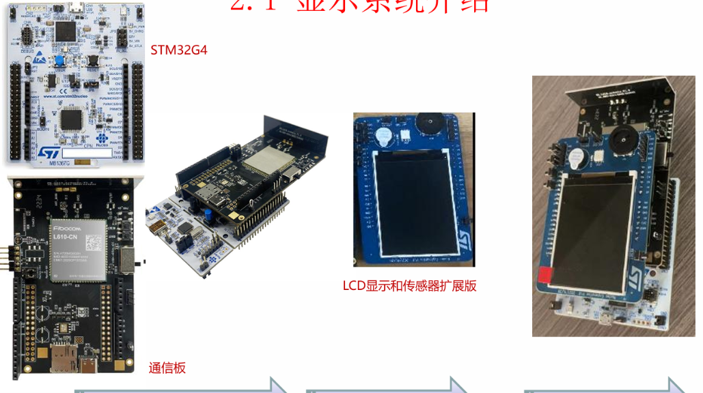

接线原理图，见报告或者其他资源部分。


# 复现项目说明

步骤：下载对应源代码后，根据其他资源部分搭建好检测电路。内网穿透+运行python服务器；插入sim卡；给通信板和开发板供电；用KEIL烧录代码到开发板；打开串口调试助手，监测STLink串口；按下复位按钮；等待TCP通信连接过程；观察项目运行。

本项目资源代码等仅供学习交流；如有抄袭等，后果自负。


# 温度检测原理

这部分具体实现组员负责。初步的大体框架1.得到采样的ADC值。2.通过查表法，将ADC值转化为温度。3.温度区间内，要通过计算法实现。表来源：商家提供。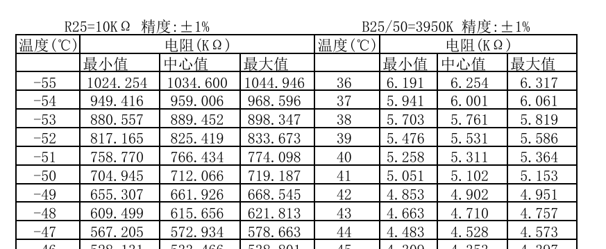

# 温度滤波原理

传感器读取的数据很可能含有噪声抖动，比如

```markdown
24.8 25.2 25.1 24.9 25.3...
```

所以，我们需要一种滤波算法，让数据更加平滑的变化。下面来介绍本次课设所采用的算法以及其与其他常见滤波算法效果比对。

## 一阶卡尔曼滤波

### 原理

参考链接[一阶卡尔曼滤波入门教程：从原理到单片机 C 代码实现](https://jishuzhan.net/article/2052189349916246018)

核心思想：根据传感器测量值和预测值做一个聪明的加权平均。实际表现为传感器噪声大，少相信传感器；系统变化快，多相信传感器。

| 变量 | 含义           | 说明                                                         |
| ---- | -------------- | ------------------------------------------------------------ |
| out  | 当前估计值     | 滤波后的输出结果                                             |
| in   | 当前测量值     | 输入值                                                       |
| Q    | 过程噪声协方差 | 表示系统本身变化的不确定度。本课设表现为NTC电阻变化的快慢。  |
| R    | 测量噪声协方差 | 传感器测量噪声。本课设表现为ADC量化误差、电磁干扰等噪声影响。 |
| P    | 估计误差协方差 | 表示当前估计值的不确定程度                                   |
| k    | 卡尔曼增益     | 相信测量值还是预测值                                         |

### 参数整定

| 参数变化 | 效果                       |
| -------- | -------------------------- |
| q 增大   | 响应更快，但数据更容易抖   |
| q 减小   | 数据更平滑，但响应变慢     |
| r 增大   | 更不相信测量值，滤波更平滑 |
| r 减小   | 更相信测量值，响应更快     |

想要响应快：增大 q 或减小 r 

想要更平滑：减小 q 或增大 r

## 效果分析比较

设定相同的温度输入值。用串口调试助手获取滤波前、滤波后值，从而用excel绘图。反应滤波效果。

### 原卡尔曼滤波

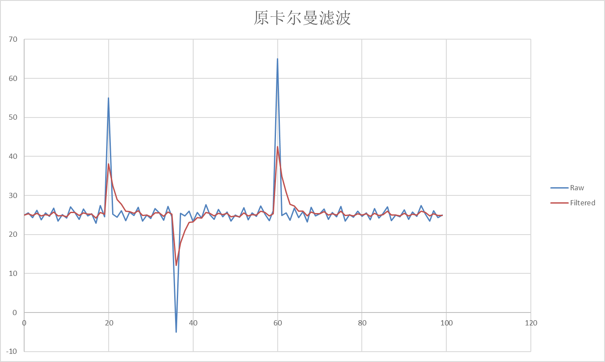

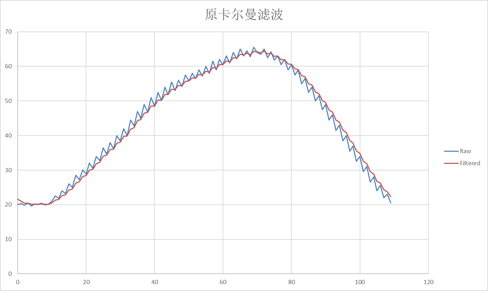


### 中值滤波

中值滤波是将信号的连续m次采样值按大小进行排序，取其中间值作为 本次的有效采样值。

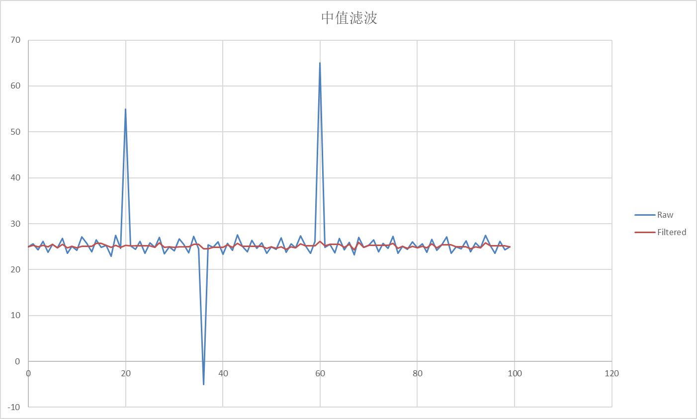

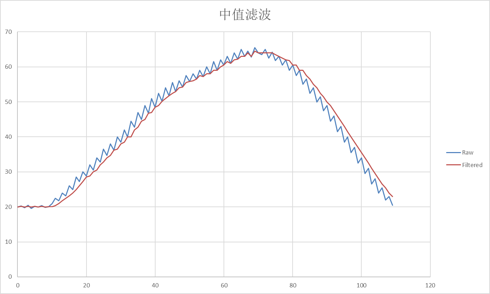


### 滑动平均滤波

滑动平均滤波是在每个采样周期只采样一次，将这一次采样值和过去的若 干次采样值一起算术平均或加权平均

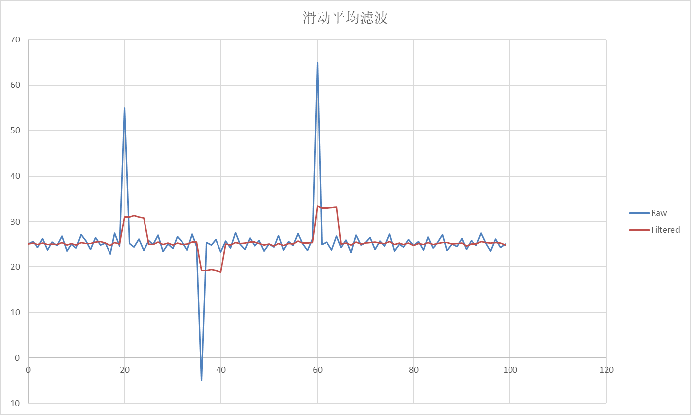

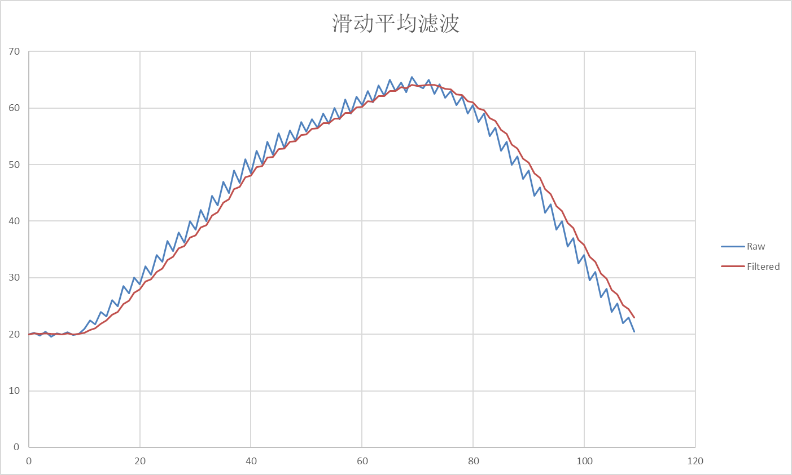


### 改进后的卡尔曼滤波

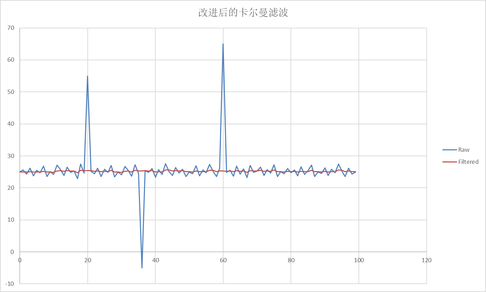

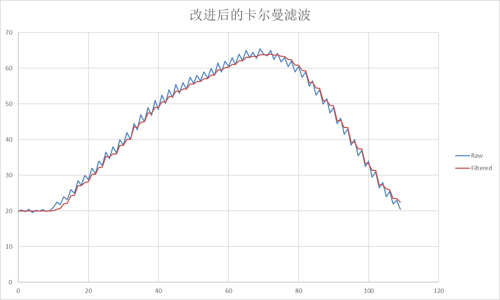


## 算法改进思路

### 添加异常值处理

比如有时电路有问题，突然松动，会导致输出骤变。此时不应该直接交给卡尔曼滤波，先做异常判断。比如下面的一个测试结果图

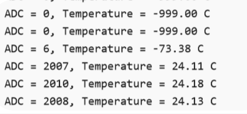

改进之后，当我们手动断开电路，模拟电路抽风，发现输出能够保持，而不是跳变。

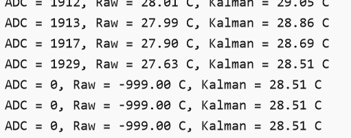

### 基于温度变化自适应修改Q、R值

在前面，我们所使用的过程噪声和测量噪声都是固定值。那是根据室温变化而取定的，但是实际上，如果我们测温温度变化巨大，那么卡尔曼滤波的动态响应就比较慢，效果不是很好，需要等待较长时间收敛。于是，采用基于温度变化幅度的自适应方法，如果温度变化明显，则自动修正Q、R值。

### 初始化输出采用第一次采样结果

out的初值会影响刚启动时的收敛速度，并且，由于前面的异常值处理。如果实际温度过大，初始diff便会大于最大增量，导致代码执行in = Kal->out;从而产生bug。

# 越限报警

这里用LED2灯的亮表示。原理图类似下面。只不过没搞上面的e

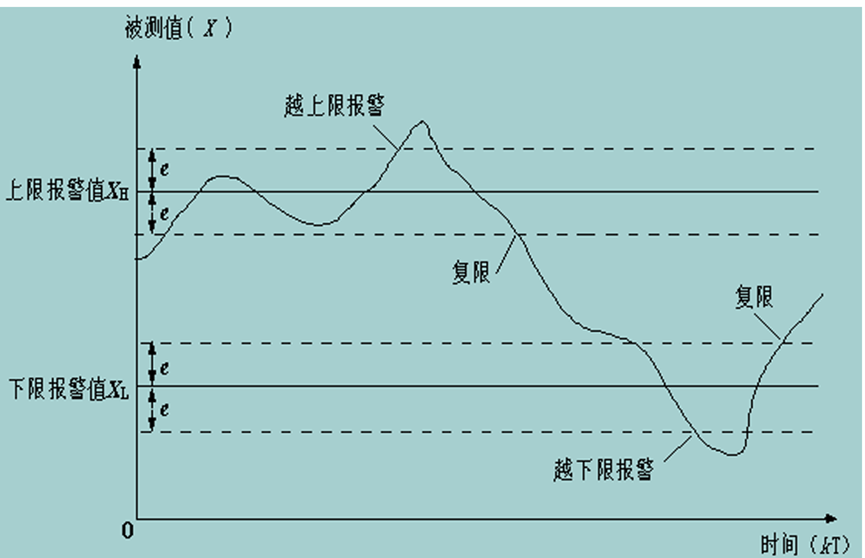


# TCP通信

 用到的串口调试软件、和另一个sscom5


运行步骤

## 内网穿透+本地服务器

内网穿透参考TCP通信里面的pdf介绍。

本地服务器python代码也在那（可以自定义修改一些东西）。要注意的是接收到的字符串格式

内网穿透如下，TCP端口3000

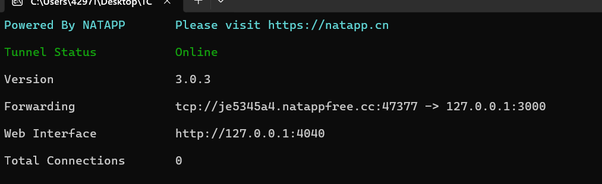

本地服务器如下：WEB端口5000，监听TCP端口3000

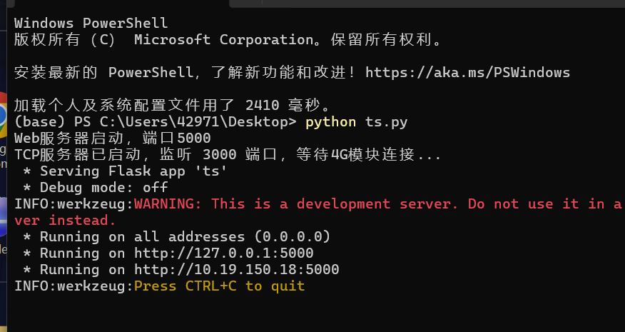

## 硬件连接

通信板开关拨到**USB供电**（更稳定），最好用可传输数据的线连接（手机充电线即可）；stm32板子要烧录好代码，并且供电。最好结合串口通信调试，多试几次（有时会抽风，重给通信板供电等）

插入手机的SIM卡

CUBEMX中，要配置PA9\PA10引脚功能为串口通信，且使能串口。


## 通信代码

可以先用AT调试，端口选0（有6个0-6，其功能不同，0是用于AT指令的）.

关于怎么连接到网络，要根据图中的指令来。其中请求IP是必须的，然后再连接公网IP。

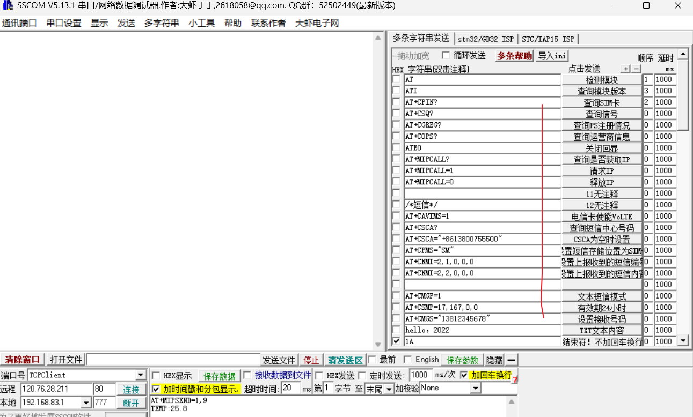

将AT指令使用STM32开发板的HAL库实现。（注意，请求IP和连接只要第一次供电后成功即可。后续error是因为已经占用了端口，并且代码中没写断开连接的AT指令）

一切正常时，这时电脑端运行的python文件就会显示：

**模块已连接: {addr}**！！！！！！！！！！

## 上传温度数据

```
这是串口调试要用的指令，可以检验是否通信成功（无需用到stm32）
AT+MIPSEND=1,9
TEMP:25.8
```

同样用HAL库实现。便可实现上传温度值到通信板。

## 最终效果如下

这里显示的效果，可以用AI重新编写Python代码。串口监控的波特率看CUBEMX中配置的串口通信接口。

然后通过局域网访问网址（原先python服务端的效果）。

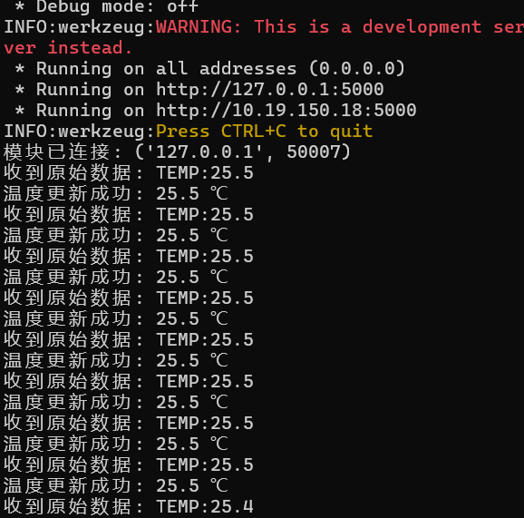

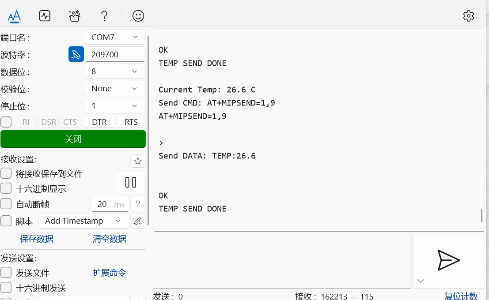

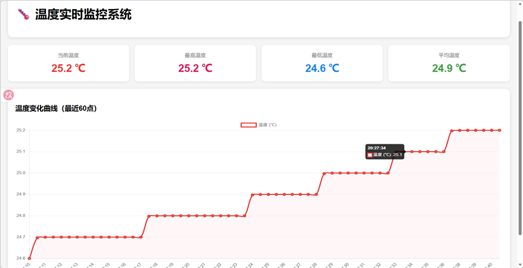


# LCD显示

组员负责。具体原理见报告、答辩文档。
