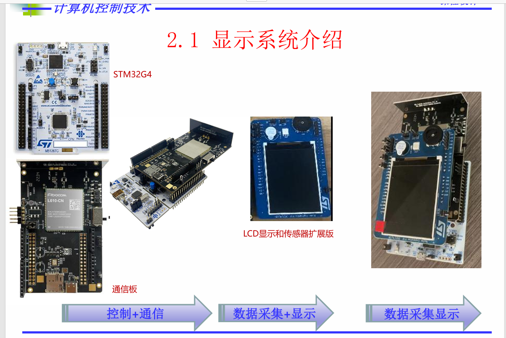
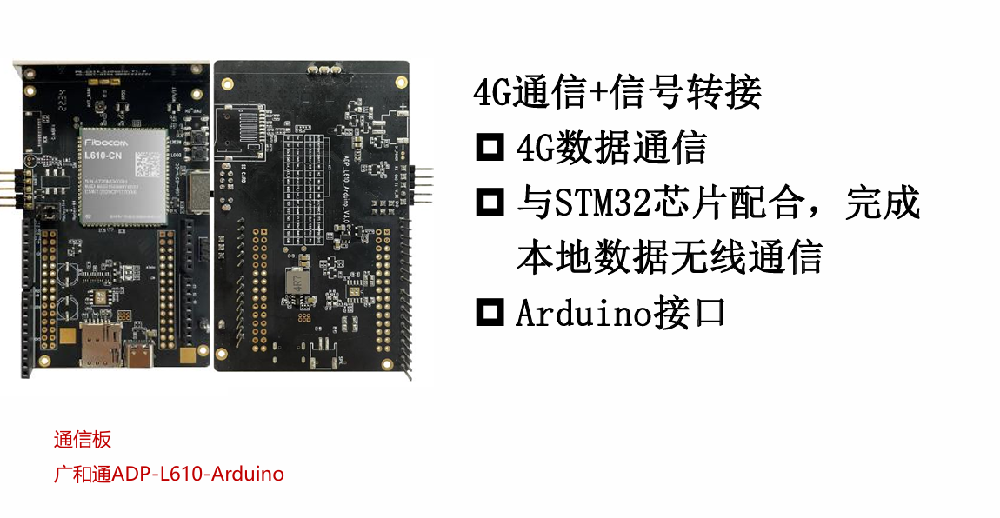
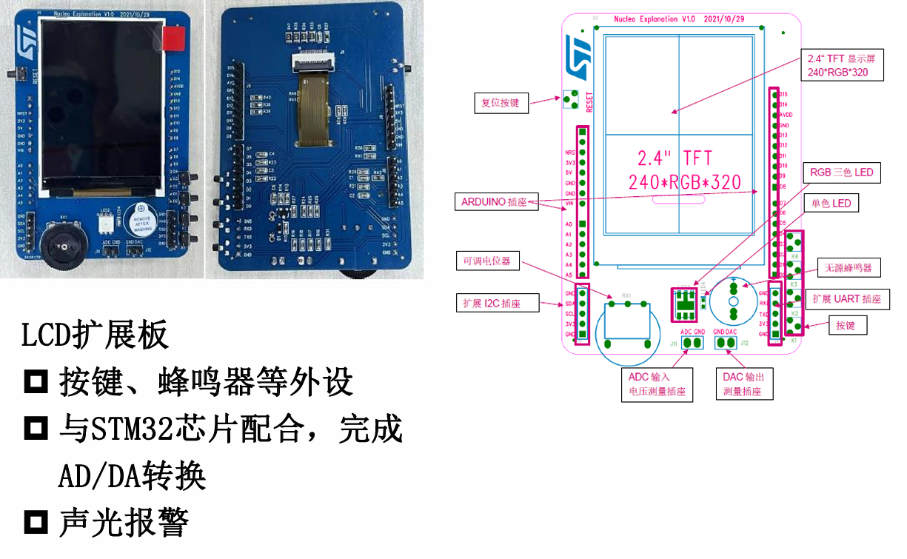
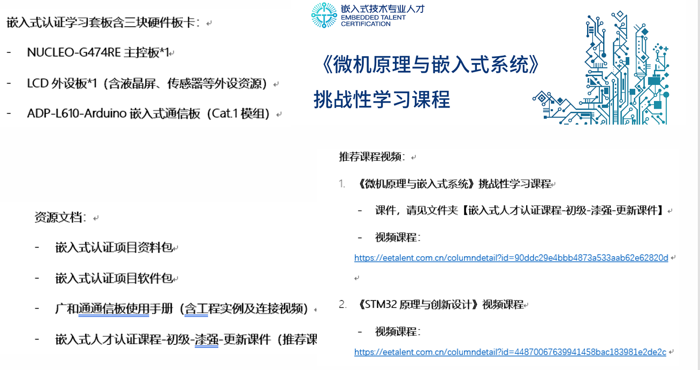
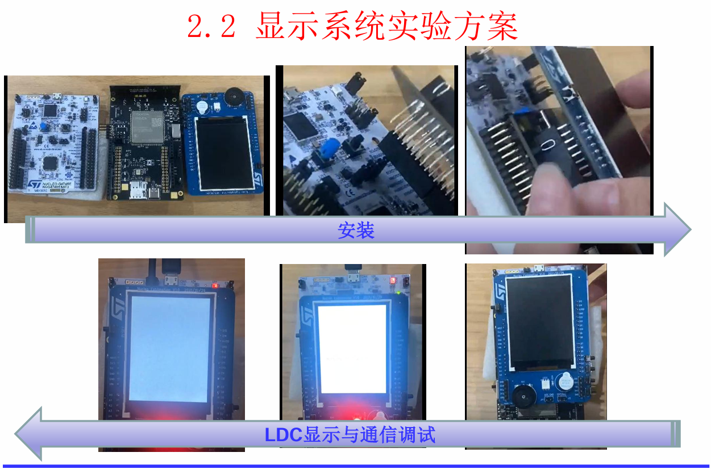
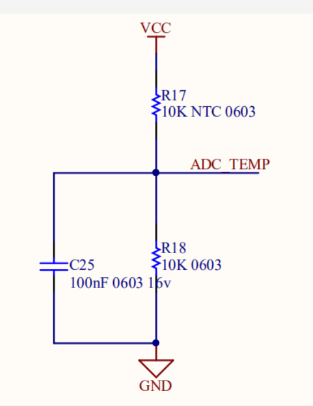

# 温度传感与LCD显示——显示传感类

## 实验所用板子

就三个：STM32G4（STM32 NUCLEO-G474RE - STM32G474RE）、通信板、LCD显示屏

**通信板**

**LCD**

**学习资料如下，可手动输入网址**

**组装图**

# 课设要求

1，通过热敏电阻实现温度检测（可自行购 置）； 

2，温度检测数量滤波要求及其算法实现；

3，滤波结果通过LCD回显

# 验收形式

1，课设文档：题目分解/分工，设计过程， 原理与算法设计，硬件实现，软件流程图， 算法实现，实验结果与分析，心得与体会， 后续改进； 

2，现场答辩形式：PPT答辩，现场演示。6月15号

# 可能的接线？

要用到的额外东西：USB线、10K欧姆电阻、面包板、10K/3950热敏电阻（或其他B系数的）、杜邦线多种、电容。用于给实验接电路。参考温度检测部分的资料。

STM32 **3.3V** → 接 10k 普通电阻一头

10k 电阻另一头 → 接一根线到 **STM32 ADC 引脚**

这个中间节点 → 再接 **热敏电阻一头**

热敏电阻另一头 → 接 STM32 **GND**

再并一个电容100nf？（值参考资料那里的）

# 分工安排以及介绍

通过下面的分组，基本可以实现组内并行工作

## 温度检测组

工作内容就是 连接电路，大概如下：

然后写一个代码，把STM32测量到的ADC值，转化为温度值。（具体实现感觉不是很难，资料里有很多示例）。最终的结果大概就是得到一个函数，会定时的（比如100ms运行一次）输出(return)一个温度值(或者数组？)。

## 滤波组

就是对第一组得到的 温度数组进行滤波，去除噪声干扰。比如温度值 10，20，13，12，11...，你要编写一个算法，得到相对平稳的温度值。大概就是这个意思吧。最终输出稳定、与实际接近的温度值。

## LCD显示组

这个从感觉上来讲应该不是很难。就是编写一个函数，能够显示温度数字。

然后编写一个界面，好看点？类似过控实验里的HMI界面的样子？

# 相关网上资源

下面列出一些网址，可以检索相关资料。搜索对应板子的名字。

[EEWORLD论坛-中国最好的电子工程师论坛之一,电子系统设计师论坛](https://bbs.eeworld.com.cn/)

[意法半导体官网 | ST官网 - STMicroelectronics](https://www.st.com.cn/content/st_com/zh.html)

# 其他

课设群的资源（如果没下）

通过网盘分享的文件：控制课程设计
链接: https://pan.baidu.com/s/1e5MZfISoCfDzbNBahf2i5A?pwd=erwf 提取码: erwf

